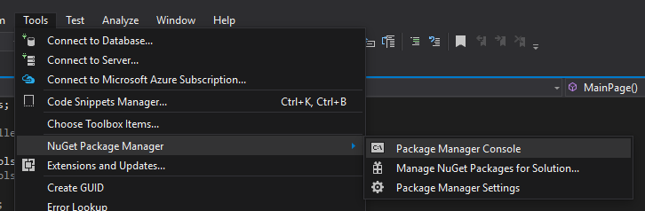
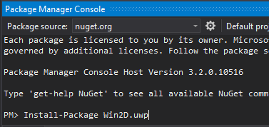
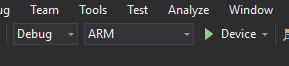
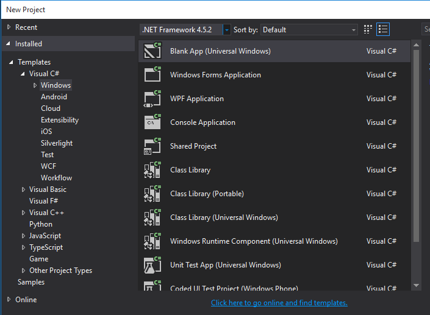
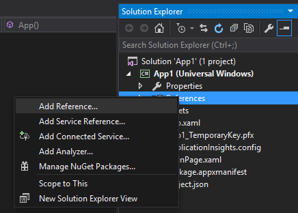
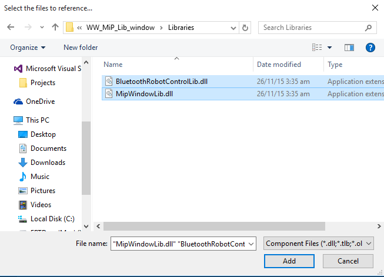

WowWee MiP Window SDK
=============================

The free MiP Window SDK lets you control your WowWee MiP robot on devices running Window 10 and [Visual Studio 2015](https://dev.windows.com/en-us/downloads). To use this SDK you will also need a physical MiP robot.

Pre-built offical SDKs are also available for [iOS](https://github.com/WowWeeLabs/MiP-iOS-SDK/), [Android](https://github.com/WowWeeLabs/MiP-Android-SDK) and also [PhoneGap](https://github.com/WowWeeLabs/MiP-PhoneGap-SDK).

For information on WowWee products visit: <http://www.wowwee.com>

Table of Contents
-----------------------------

- [Quick Play for TestApp](#quickplayfortestapp)
- [Quick Installation](#quickinstallation)
- [Notes about the SDK](#notesaboutthesdk)
- SDK Documentation (coming soon)
- [License](#license)
- [Contributing](#contributing)
- [Credits](#credits)
- [Projects using this SDK](#projectsusingthissdk)

Quick Play for TestApp
-----------------------------

1. Clone the repository

		git clone https://github.com/WowWeeLabs/MiP-Windows-SDK.git
		
2. Open the solution on Visual Studio 2015

3. Install graphic library "(Win2D)[https://github.com/Microsoft/Win2D]" through NuGet

	+ open `Package Manager Console` under `Tools` > `NuGet Packager Manager`
	
		
	
	+ input the command `Install-Package Win2D.uwp` within console window
	
		
		
4. Finally, plug your phone to window, choose `ARM` with `Device` and then press the playback button to launch the app

	

Quick Installation
-----------------------------

1. Clone the repository

		git clone https://github.com/WowWeeLabs/MiP-Windows-SDK.git

2. In Visual Studio 2015, create a Blank App (Universal Window)

	

3. Under Solution Explorer, choose `References` on your project, then right click to select `Add Reference...`

	
	
4. Browse the folder `Libraries` under `MiP-Windows-SDK` (step1) and choose `BluetoothRobotControlLib.dll` and `MipWindowLib.dll`

	
	
5. Let start to code. Open `MainPage.xaml.cs` under `MainPage.xaml` on Solution Explorer.

	+ Add the code for using libraries

			using MipWindowLib.MipRobot;
			using System.Threading.Tasks;
			
	+ Add the code to search Mip and remote it to move forward
	
			Task.Run(async () =>
			{
				//scan any paired devices
				await MipRobotFinder.Instance.ScanForRobots();
				//pick anyone from them
				MipRobot mip = MipRobotFinder.Instance.FoundRobotList.FirstOrDefault();
				if (mip != null)
				{
					//connect it
					if (await mip.Connect())
					{
						//let MiP to move forward
						await mip.MipDrive(new System.Numerics.Vector2(-100, 0));
					}
				}
			});
			
6. Enable the bluetooth on Window Phone (`Setting Page` > `Device` > `Bluetooth`), then try to pair your MiP(its name should be "WowWee-MiP-xxxxx" by default) after switch on bluetooth and input `0000` as pin code.

7. Finally, plug your phone to window, choose `ARM` with `Device` and then press the playback button to launch the app

	

Notes about the SDK
-----------------------------

### Window 8 Compatible

For now we do not support Window 8 yet. Pull requests are welcome.

### Emulator Support

Our SDK fully builds for the simulator, however at present the Window emulator does not support Bluetooth Low Energy. This means you will not be able to properly test the functionality without using a real Window 10 device(Desktop or Phone).

### Full Source Code

At this stage we do not plan on releasing our full library source code. 

### Are there any restrictions on releasing my own application?

The SDK is currently and will always be free for you to build and release your own applications. Your welcome to charge money or release free applications using our SDK without restrictions.

If you create a great application, all we ask is that you provide a link for people to purchase their own MiP so they can enjoy your product.

### Window 10 Desktop Support

Currently the SDK is also available for Window 10 Desktop, since SDK is built for Universal Windows Platform (UWP) in the Windows Software Development Kit (SDK) for Windows 10.

### Can I use your XBox joystick?

Yes we have provided the source code in our sample project, feel free to use this or make changes as you want. We would love pull requests.

Anyway, [Windows.Gaming.Input at MSDN](https://msdn.microsoft.com/en-us/library/windows/apps/windows.gaming.input.aspx) for your reference.

### Can I create other language versions of the SDK?

The lower level BLE command protocol is available in our [MiP-BLE-Protocol](http://github.com/WowWeeLabs/MiP-BLE-Protocol) repository.

License
---------------------------------
MiP iOS SDK is available under the Apache License, Version 2.0 license. See the [LICENSE.txt](LICENSE.md) file for more info.

You are free to use our SDK in your own projects whether free or paid. There are no restrictions on releasing into the Microsoft Store, Apple App Store or Google Play.

Contributing
---------------------------------
We happily accept any pull requests and monitor issues on GitHub regularly. Please feel free to give us your suggestions or enhancements. Please note that due to resource constraints we most likely cannot add new features to the MiP robot himself, but we will certainly consider them for inclusion to future robots/versions.

Tell your friends, fork our project, buy our robot and share with us your own projects! These are the best kinds of positive feedback to us.

Credits
---------------------------------
* [MiP WinRT SDK](http://mipwinrtsdk.codeplex.com/)
* [Win2D](https://github.com/Microsoft/Win2D)

Projects using this SDK
---------------------------------
* Send us a pull request to add your app here